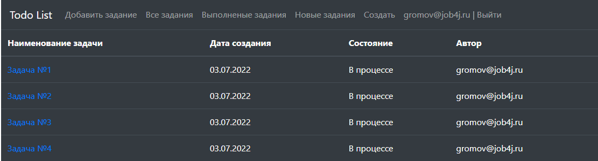
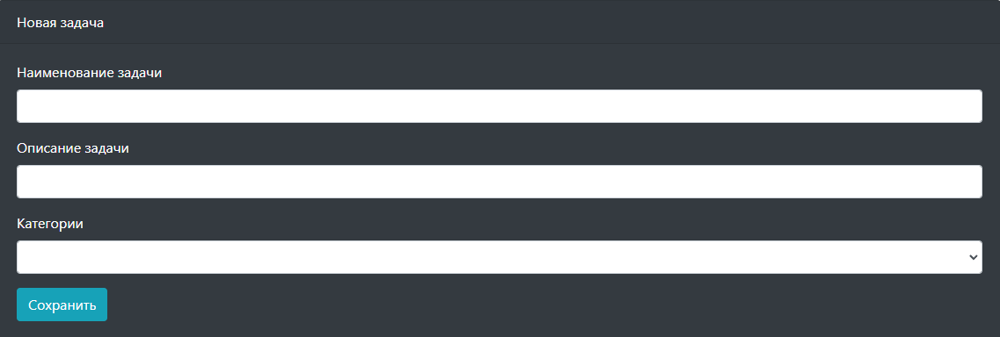
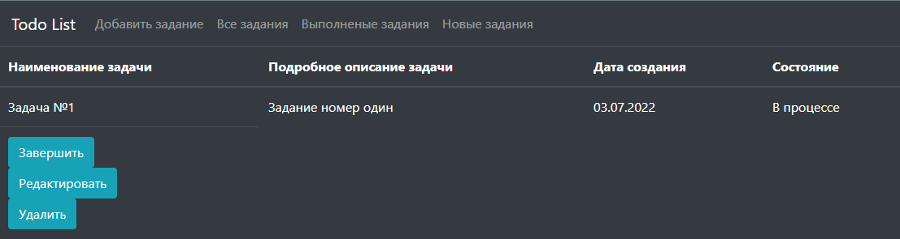

# job4j_todo Приложение "TODO список"

Описание:
- В проекте осуществляется разрабатка приложения "TODO список".

Используемая библиотка:
- В проекте использоватся Spring boot, как основная библиотека.
- Данные сохраняются через hibernate.

Технологии
<ul>
    <li>Java 14</li>
    <li>Java EE Servlets</li>
    <li>PostgreSQL, Hibernate, Liquibase</li>
    <li>JUnit, Mockito, PowerMock</li>
    <li>Maven, Tomcat</li>
    <li>HTML, JavaScript, jQuery, JSON</li>
    <li><a href="https://materializecss.com">Material Design library</a></li>
</ul>





Сборка
<ol>
    <li>
        Для успешной сборки и работы проекта на вашем компьютере должны быть установлены:
        <ol>
            <li>JDK 14(+)</li>
            <li>Maven</li>
            <li>PostgreSQL</li>
            <li>Tomcat</li>
        </ol>
    </li>
    <li>
        В PostgreSQL создайте базу с именем "job4j_todo"
    </li>
    <li>
        Скачайте проект к себе на компьютер с помощью команды<br>
        <code>git clone https://github.com/ReyBos/job4j_todo.git</code><br>
        перейдите в корень проекта
    </li>
    <li>
        Добавьте настройки для доступа к базе данных, для этого внесите соответствующие изменения в файле 
        <code>src/main/resources/hibernate.cfg.xml</code><br>
        и в файле конфигурации проекта <code>pom.xml</code>
    
``` 
<profile>   
    <id>production</id>
    <properties>
        <db.url>jdbc:postgresql://127.0.0.1:5432/job4j_todo</db.url>
        <db.username>postgres</db.username>
        <db.password>password</db.password>
        <db.driver>org.postgresql.Driver</db.driver>
    </properties>
</profile>
```
</li>
    <li>
        Выполните команду <code>mvn install -DskipTests -Pproduction</code> в корне проекта для его сборки<br>
        Будет выполнена миграция БД с помощью Liquibase.<br>
        В случае успешной сборки появится файл <code>target/todo-&#60;version&#62;.war</code><br>
        переименуйте его в <code>todo.war</code>
    </li>
    <li>
        Для запуска веб-приложения вам нужно скопировать <code>todo.war</code> в папку <code>webapps</code> вашего Tomcat
    </li>
    <li>
        После запуска сервера приложение будет доступно по адресу<br>
        <a href="http://localhost:8080/todo/">http://localhost:8080/todo/</a>
    </li>
</ol>
